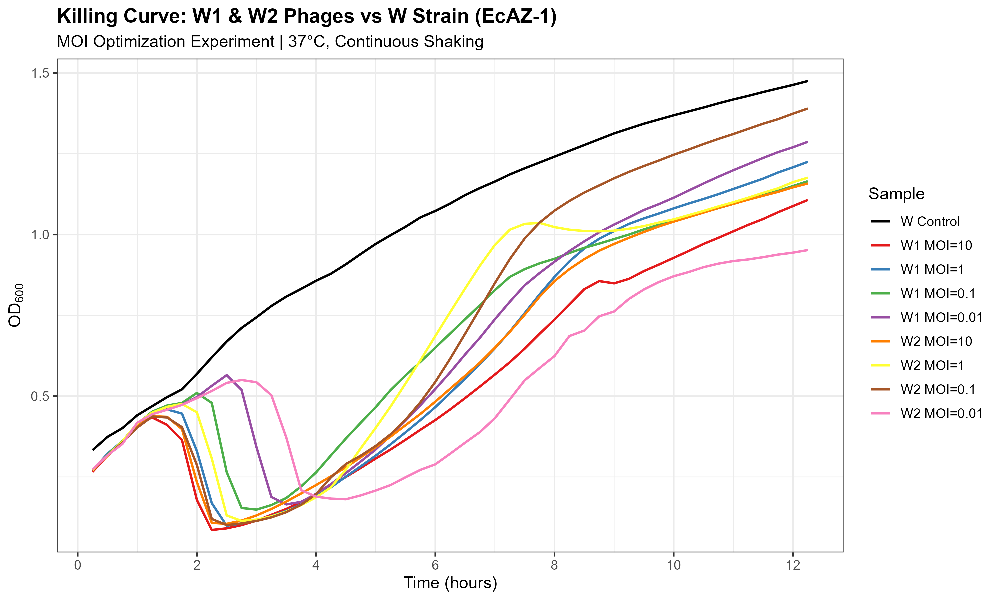
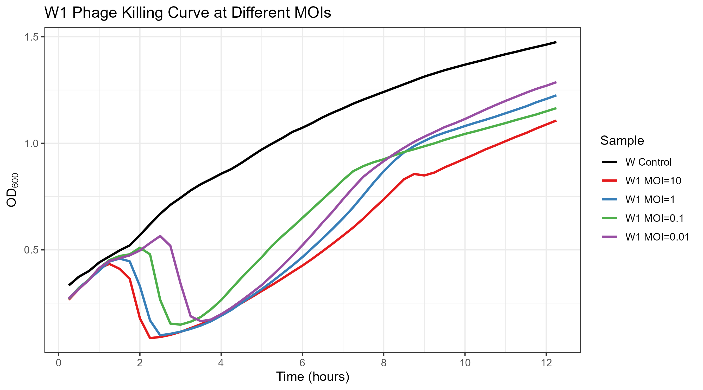
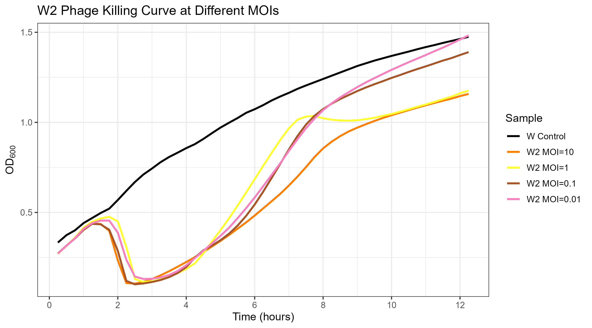
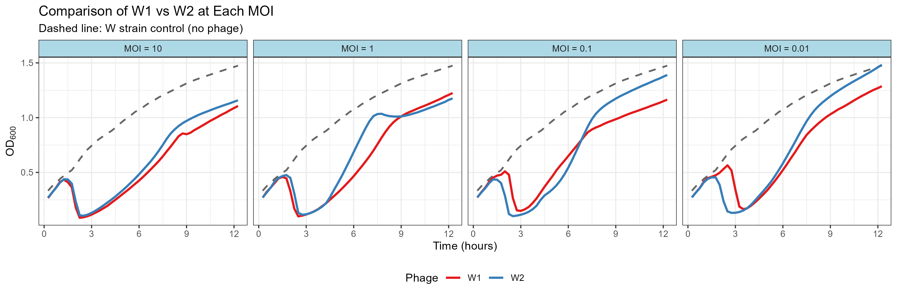

# 杀菌曲线 (Killing Curve / Lysis Kinetics)

## 基本信息

| 项目 | 内容 |
|------|------|
| 实验日期 | 2025-01-18 |
| 操作人员 | |
| 状态 | **已完成（W菌MOI优化）** |
| 前置条件 | 需完成滴度测定 (04) ✓ |

---

## 实验目的

测定5株噬菌体对宿主菌的杀菌效力，评估：
1. 不同噬菌体的杀菌速度和效果
2. 最佳感染复数 (MOI)
3. 为噬菌体鸡尾酒配方提供数据支持

---

## 一步生长曲线 vs 杀菌曲线

| 实验 | 视角 | 测量 | 获得参数 |
|------|------|------|----------|
| 一步生长曲线 | 噬菌体 | PFU/mL随时间变化 | 潜伏期、burst size |
| **杀菌曲线** | **细菌** | **OD600随时间变化** | **杀菌速度、杀菌效率** |

---

## 实验设计

### 噬菌体-宿主组合矩阵

根据宿主范围测定结果设计：

| 噬菌体 | R菌 (EcAZ-2-OVA) | W菌 (EcAZ-1) | 备注 |
|--------|:----------------:|:------------:|------|
| R1 | ✓ | ✗ | 窄宿主范围 |
| R2 | ✓ | ✓ | 浑浊斑块 |
| R3 | ✓ | ✓ | 高滴度 |
| W1 | ✓ | ✓ | |
| W2 | ✓ | ✓ | |

**共9种有效组合** (R1不能感染W菌)

---

### 实验分两阶段

#### 阶段一：初筛（固定MOI，比较所有组合）

**目的**: 在相同条件下比较9种组合的杀菌效果

| 参数 | 设置 |
|------|------|
| MOI | **1** (每个细菌对应1个噬菌体) |
| 细菌起始OD600 | 0.2-0.3 |
| 测量时间 | 0, 1, 2, 3, 4, 5, 6, 8h |
| 重复 | 3次 |
| 总样本数 | 9组合 × 3重复 + 2对照 × 3重复 = 33孔 |

#### 阶段二：MOI优化（选择优势组合）

**目的**: 确定每种噬菌体的最佳MOI

| 参数 | 设置 |
|------|------|
| MOI | 0.001, 0.01, 0.1, 1, 10 |
| 选择组合 | 初筛中效果最好的3-4种 |

---

## 96孔板设计

### 阶段一：初筛板布局

```
        1    2    3    4    5    6    7    8    9   10   11   12
    ┌────────────────────────────────────────────────────────────┐
  A │ R对照│ R对照│ R对照│ W对照│ W对照│ W对照│     │     │     │     │     │     │
    ├────────────────────────────────────────────────────────────┤
  B │ R1-R │ R1-R │ R1-R │  -   │  -   │  -   │     │     │     │     │     │     │
    ├────────────────────────────────────────────────────────────┤
  C │ R2-R │ R2-R │ R2-R │ R2-W │ R2-W │ R2-W │     │     │     │     │     │     │
    ├────────────────────────────────────────────────────────────┤
  D │ R3-R │ R3-R │ R3-R │ R3-W │ R3-W │ R3-W │     │     │     │     │     │     │
    ├────────────────────────────────────────────────────────────┤
  E │ W1-R │ W1-R │ W1-R │ W1-W │ W1-W │ W1-W │     │     │     │     │     │     │
    ├────────────────────────────────────────────────────────────┤
  F │ W2-R │ W2-R │ W2-R │ W2-W │ W2-W │ W2-W │     │     │     │     │     │     │
    ├────────────────────────────────────────────────────────────┤
  G │ 空白 │ 空白 │ 空白 │     │     │     │     │     │     │     │     │     │
    ├────────────────────────────────────────────────────────────┤
  H │     │     │     │     │     │     │     │     │     │     │     │     │
    └────────────────────────────────────────────────────────────┘

图例：
- R对照: R菌 + LB (无噬菌体)
- W对照: W菌 + LB (无噬菌体)
- R1-R: R1噬菌体 + R菌
- R2-W: R2噬菌体 + W菌
- 空白: 仅LB (无菌对照)
```

---

## 实验材料

### 噬菌体

| 名称 | 滴度 (PFU/mL) | MOI=1所需量 | 备注 |
|------|---------------|-------------|------|
| R1 | <!-- 待填 --> | | 仅R菌 |
| R2 | <!-- 待填 --> | | |
| R3 | <!-- 待填 --> | | |
| W1 | <!-- 待填 --> | | |
| W2 | <!-- 待填 --> | | |

### 细菌

| 菌株 | 所需OD600 | 所需体积 |
|------|-----------|----------|
| EcAZ-2-OVA (R菌) | 0.2-0.3 | ~20 mL |
| EcAZ-1 (W菌) | 0.2-0.3 | ~20 mL |

### 仪器设备

- [ ] 96孔板 (平底，透明)
- [ ] 酶标仪/微孔板读数仪 (OD600)
- [ ] 37°C摇床或培养箱
- [ ] 多道移液器

---

## 实验方案

### 1. 准备工作

1. 前一天接种R菌和W菌过夜培养
2. 实验当天稀释至OD600 ≈ 0.1，培养至对数期 (OD600 ≈ 0.2-0.3)
3. 计算细菌浓度：OD600 = 0.2 ≈ 2×10^8 CFU/mL

### 2. MOI计算

**公式**:
```
所需噬菌体体积 = (细菌数 × MOI) / 噬菌体滴度
```

**示例** (MOI=1, 200μL体系):
- 细菌数 = 0.2 × 2×10^8 × 0.2mL = 8×10^6 CFU
- 如噬菌体滴度 = 10^8 PFU/mL
- 所需噬菌体 = 8×10^6 / 10^8 = 0.08 mL = 80 μL

### 3. 加样顺序

| 步骤 | 内容 | 体积 |
|------|------|------|
| 1 | 加入LB培养基 | 补足至200μL |
| 2 | 加入对数期细菌 | 按计算量 |
| 3 | 加入噬菌体稀释液 | 按MOI计算 |
| 4 | 混匀 | 轻轻吹打或振荡 |

### 4. 培养与测量

| 项目 | 设置 |
|------|------|
| 温度 | 37°C |
| 振荡 | 有条件则振荡培养 |
| 测量时间点 | 0, 1, 2, 3, 4, 5, 6, 8h |
| 测量指标 | OD600 |

### 5. 数据记录

每个时间点读取OD600值，记录于下表。

---

## 实验记录

### 操作日志

| 时间 | 操作 | 观察/备注 |
|------|------|-----------|
| 2025-01-17 23:28 | W菌培养（杀菌曲线用） | 培养W菌至对数期（目标OD₆₀₀≈0.2），用于W菌杀菌曲线实验 |
| 2025-01-18 01:24 | W菌OD₆₀₀测定 | 原始值—W菌: 0.609, 0.607, 0.588; 空白: 0.052, 0.052, 0.052。扣空白后均值: 0.549 |
| 2025-01-18 01:24 | W菌稀释至OD₆₀₀≈0.2 | 取3.6mL菌液+6.4mL LB稀释2.75倍，用于杀菌曲线实验 |
| 2025-01-18 02:50 | W菌MOI优化实验加样并启动 | **实验设计**: W1和W2各4个MOI (0.01, 0.1, 1, 10)，共8组×3重复=24孔 + LB空白6孔 + W对照6孔；周围封SM溶液防蒸发 |
| 2025-01-18 02:50 | 仪器运行参数 | **BioTek Epoch 2**: 37°C恒温，持续轨道振荡(425 cpm, 3mm)，OD₆₀₀测定，每15min读数一次，共12h运行，49个读数点 |
| 2025-01-18 ~15:00 | 实验结束，数据导出 | 原始数据保存至 `Experiments/Data/08_杀菌曲线/` |
| 2026-01-19 18:30 | R菌培养（R菌MOI优化实验用） | 100μL过夜菌+5mL LB，待OD₆₀₀=0.2后进行实验 |
| 2026-01-19 | R菌MOI优化实验准备 | **噬菌体稀释方案**—R1(2.5×10¹⁰): 原液/10⁻¹/10⁻²/10⁻³对应MOI=10/1/0.1/0.01; R2(3.7×10¹⁴): 10⁻⁴/10⁻⁵/10⁻⁶/10⁻⁷; R3(8.7×10¹⁰): 原液/10⁻¹/10⁻²/10⁻³。注：R1原液MOI实际≈7.8 |
| 2026-01-19 20:42 | R菌OD₆₀₀测定 | 原始值—R菌: 0.196, 0.221, 0.217; 空白: 0.051, 0.051, 0.050。扣空白后均值: 0.161，未达目标0.2，继续培养 |
| 2026-01-19 21:15 | R菌OD₆₀₀测定（第二次） | 原始值—R菌: 0.327, 0.343, 0.343; 空白: 0.053, 0.052, 0.052。扣空白后均值: 0.286，已达对数期，可进行MOI实验 |
| 2026-01-19 21:45 | R菌MOI优化实验加样并启动 | R菌稀释至OD₆₀₀≈0.2（7mL菌液+3mL LB）；**实验设计**: R1、R2、R3各4个MOI (0.01, 0.1, 1, 10)，共12组×3重复=36孔 + LB空白6孔 + R菌对照6孔；周围封SM溶液防蒸发；BioTek Epoch 2运行 |

---

### W菌MOI优化实验 (2025-01-18)

#### 96孔板布局

```
        1    2    3    4    5    6    7    8    9   10   11   12
    ┌────────────────────────────────────────────────────────────┐
  A │ SM  │ SM  │ SM  │ SM  │ SM  │ SM  │ SM  │ SM  │ SM  │ SM  │ SM  │ SM  │
    ├────────────────────────────────────────────────────────────┤
  B │ SM  │ LB  │  W  │W1-10│W1-.1│W2-.1│W2-10│ SM  │    │    │    │    │
    ├────────────────────────────────────────────────────────────┤
  C │ SM  │ LB  │  W  │W1-10│W1-.1│W2-.1│W2-10│ SM  │    │    │    │    │
    ├────────────────────────────────────────────────────────────┤
  D │ SM  │ LB  │  W  │W1-10│W1-.1│W2-.1│W2-10│ SM  │    │    │    │    │
    ├────────────────────────────────────────────────────────────┤
  E │ SM  │ LB  │  W  │W1-1 │W1-.01│W2-.01│W2-1│ SM  │    │    │    │    │
    ├────────────────────────────────────────────────────────────┤
  F │ SM  │ LB  │  W  │W1-1 │W1-.01│W2-.01│W2-1│ SM  │    │    │    │    │
    ├────────────────────────────────────────────────────────────┤
  G │ SM  │ LB  │  W  │W1-1 │W1-.01│W2-.01│W2-1│ SM  │    │    │    │    │
    ├────────────────────────────────────────────────────────────┤
  H │ SM  │ SM  │ SM  │ SM  │ SM  │ SM  │ SM  │ SM  │ SM  │ SM  │ SM  │ SM  │
    └────────────────────────────────────────────────────────────┘

图例：
- SM: SM缓冲液（封边防蒸发）
- LB: LB培养基空白对照
- W: W菌对照（无噬菌体）
- W1-10: W1噬菌体 + W菌, MOI=10
- W1-1: W1噬菌体 + W菌, MOI=1
- W1-.1: W1噬菌体 + W菌, MOI=0.1
- W1-.01: W1噬菌体 + W菌, MOI=0.01
```

#### 样本编号对照表

| 仪器编号 | 噬菌体 | MOI | 位置 |
|----------|--------|-----|------|
| WP1 | W1 | 10 | B4, C4, D4 |
| WP2 | W1 | 1 | E4, F4, G4 |
| WP3 | W1 | 0.1 | B5, C5, D5 |
| WP4 | W1 | 0.01 | E5, F5, G5 |
| WP5 | W2 | 0.1 | B6, C6, D6 |
| WP6 | W2 | 0.01 | E6, F6, G6 |
| WP7 | W2 | 10 | B7, C7, D7 |
| WP8 | W2 | 1 | E7, F7, G7 |

---

## 实验结果

### MOI优化杀菌效力汇总

| 噬菌体 | MOI | Lagtime (裂解启动) | Max V (杀菌速率) | CV% | 效力评分 |
|--------|-----|-------------------|------------------|-----|----------|
| **W1** | **10** | **0:56** | -5.0 | 2.2% | ⭐⭐⭐ 最快 |
| W1 | 1 | 1:22 | -5.9 | 0.6% | ⭐⭐⭐ |
| W1 | 0.1 | 1:46 | -6.4 | 0.8% | ⭐⭐⭐ |
| W1 | 0.01 | 2:08 | -6.5 | 2.4% | ⭐⭐⭐ |
| W2 | 10 | 1:57 | -6.4 | 1.2% | ⭐⭐⭐ |
| **W2** | **1** | **2:17** | **-7.0** | 2.4% | ⭐⭐⭐ 最强 |
| W2 | 0.1 | 2:51 | -6.1 | 8.5% | ⭐⭐⭐ |
| W2 | 0.01 | 3:42 | -6.6* | 0.9% | ⭐⭐ |
| W对照 | - | - | +3.4 | 58% | (正常生长) |

*注：W2 MOI=0.01组G6孔异常（Max V=+3.4，细菌持续生长），已从分析中排除，仅使用E6+F6均值。可能为加样失误（漏加噬菌体）

**杀菌效力评分标准**:
- ⭐⭐⭐: Lagtime < 3h，有效裂解
- ⭐⭐: Lagtime 3-5h，裂解较慢
- ⭐: Lagtime > 5h 或裂解不完全

### 关键发现

1. **W1噬菌体**:
   - MOI=10时裂解最快（56分钟启动）
   - 所有MOI都能有效杀菌
   - 高MOI = 更快裂解

2. **W2噬菌体**:
   - MOI=1时杀菌效率最高（Max V = -7.0）
   - 低MOI (0.01) 裂解明显延迟
   - 整体裂解速度比W1稍慢

3. **最佳MOI推荐**:
   - W1: MOI ≥ 1（追求速度用MOI=10）
   - W2: MOI = 1（最佳平衡点）

### 杀菌曲线图

#### 全部样本



#### W1噬菌体不同MOI对比



#### W2噬菌体不同MOI对比



#### W1 vs W2 分面比较



### 结论

W1和W2噬菌体对W菌（EcAZ-1）均表现出强效杀菌能力。W1在高MOI时裂解更快，W2在MOI=1时效率最高。两者可作为W菌噬菌体鸡尾酒的候选株。

---

## 后续计划

### 如果时间允许：阶段二MOI优化

根据初筛结果，选择效果最好的组合进行MOI优化实验。

| 选择组合 | 测试MOI |
|----------|---------|
| | 0.001, 0.01, 0.1, 1, 10 |
| | 0.001, 0.01, 0.1, 1, 10 |
| | 0.001, 0.01, 0.1, 1, 10 |

---

## 问题与改进

<!-- 待实验完成后填写 -->

---

## 参考方案

- `Protocols/Phage Growth Kinetics protocol.pdf`
- `Protocols/Growth kinetics 96 well design.pdf`

---

## 附录：数据分析代码 (R)

```r
# 读取数据
data <- read.csv("killing_curve_data.csv")

# 绘制杀菌曲线
library(ggplot2)

ggplot(data, aes(x = Time, y = OD600, color = Treatment)) +
  geom_line() +
  geom_point() +
  facet_wrap(~Host) +
  theme_bw() +
  labs(title = "Killing Curve",
       x = "Time (h)",
       y = "OD600")
```

---

*创建日期: 2025-01-14*
